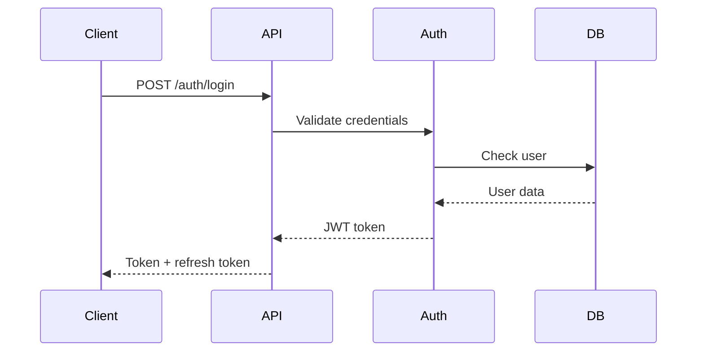

# SafeMate API Documentation

## 🔌 **Overview**

This directory contains comprehensive API documentation for SafeMate, including endpoint specifications, integration guides, authentication methods, and API usage examples.

## 📚 **Documentation Structure**

### **📋 [API Reference](reference/)**
- Complete API endpoint documentation
- Request/response schemas
- Error codes and messages
- Rate limiting information

### **🔐 [Authentication](authentication/)**
- Authentication methods and flows
- JWT token management
- API key configuration
- Security best practices

### **🔗 [Integration](integration/)**
- SDK and client libraries
- Webhook configurations
- Real-time updates
- Integration examples

### **📊 [Examples](examples/)**
- Code examples in multiple languages
- Common use cases
- Best practices
- Troubleshooting guides

### **🔧 [Testing](testing/)**
- API testing strategies
- Postman collections
- Unit test examples
- Integration test guides

### **📈 [Monitoring](monitoring/)**
- API performance metrics
- Error tracking
- Usage analytics
- Health checks

## 🏗️ **API Architecture**

### **REST API Structure**
```
┌─────────────────┐    ┌─────────────────┐    ┌─────────────────┐
│   Client        │    │   API Gateway   │    │   Lambda        │
│   Applications  │◄──►│   (REST API)    │◄──►│   Functions     │
└─────────────────┘    └─────────────────┘    └─────────────────┘
                                │                       │
                                ▼                       ▼
                       ┌─────────────────┐    ┌─────────────────┐
                       │   DynamoDB      │    │   External      │
                       │   (Database)    │    │   Services      │
                       └─────────────────┘    └─────────────────┘
```

### **API Endpoints**
- **Base URL**: `https://api.safemate.com/`
- **Version**: `v1`
- **Format**: JSON
- **Encoding**: UTF-8

## 📋 **API Endpoints**

### **Authentication Endpoints**
```
POST   /auth/login              # User login
POST   /auth/logout             # User logout
POST   /auth/refresh            # Refresh token
POST   /auth/register           # User registration
POST   /auth/forgot-password    # Password reset
POST   /auth/reset-password     # Reset password
```

### **User Management Endpoints**
```
GET    /users                   # List users
GET    /users/{id}              # Get user details
POST   /users                   # Create user
PUT    /users/{id}              # Update user
DELETE /users/{id}              # Delete user
GET    /users/{id}/profile      # Get user profile
PUT    /users/{id}/profile      # Update user profile
```

### **Wallet Management Endpoints**
```
GET    /wallets                 # List wallets
GET    /wallets/{id}            # Get wallet details
POST   /wallets                 # Create wallet
PUT    /wallets/{id}            # Update wallet
DELETE /wallets/{id}            # Delete wallet
POST   /wallets/{id}/transfer   # Transfer funds
GET    /wallets/{id}/balance    # Get wallet balance
GET    /wallets/{id}/history    # Get transaction history
```

### **Hedera Integration Endpoints**
```
POST   /hedera/transaction      # Submit Hedera transaction
GET    /hedera/transaction/{id} # Get transaction status
GET    /hedera/account/{id}     # Get account details
POST   /hedera/token/create     # Create token
GET    /hedera/token/{id}       # Get token details
POST   /hedera/contract/deploy  # Deploy smart contract
```

### **File Management Endpoints**
```
GET    /files                   # List files
GET    /files/{id}              # Get file details
POST   /files                   # Upload file
PUT    /files/{id}              # Update file
DELETE /files/{id}              # Delete file
GET    /files/{id}/download     # Download file
POST   /files/{id}/share        # Share file
```

## 🔐 **Authentication**

### **Authentication Methods**
- **JWT Tokens**: Primary authentication method
- **API Keys**: For service-to-service communication
- **OAuth 2.0**: For third-party integrations
- **Session-based**: For web applications

### **JWT Token Structure**
```json
{
  "header": {
    "alg": "HS256",
    "typ": "JWT"
  },
  "payload": {
    "sub": "user123",
    "iss": "safemate-api",
    "aud": "safemate-client",
    "iat": 1640995200,
    "exp": 1641081600,
    "scope": "read write"
  }
}
```

### **Authentication Flow**


## 📊 **Request/Response Format**

### **Standard Request Format**
```json
{
  "method": "POST",
  "url": "https://api.safemate.com/v1/wallets",
  "headers": {
    "Authorization": "Bearer <jwt_token>",
    "Content-Type": "application/json",
    "Accept": "application/json"
  },
  "body": {
    "name": "My Wallet",
    "type": "hedera",
    "description": "Personal wallet"
  }
}
```

### **Standard Response Format**
```json
{
  "success": true,
  "data": {
    "id": "wallet123",
    "name": "My Wallet",
    "type": "hedera",
    "address": "0.0.123456",
    "balance": "100.0",
    "created_at": "2025-01-01T00:00:00Z",
    "updated_at": "2025-01-01T00:00:00Z"
  },
  "meta": {
    "timestamp": "2025-01-01T00:00:00Z",
    "request_id": "req_123456789"
  }
}
```

### **Error Response Format**
```json
{
  "success": false,
  "error": {
    "code": "VALIDATION_ERROR",
    "message": "Invalid input data",
    "details": {
      "field": "name",
      "issue": "Name is required"
    }
  },
  "meta": {
    "timestamp": "2025-01-01T00:00:00Z",
    "request_id": "req_123456789"
  }
}
```

## 🔗 **Integration Examples**

### **JavaScript/Node.js**
```javascript
const axios = require('axios');

class SafeMateAPI {
  constructor(baseURL, apiKey) {
    this.client = axios.create({
      baseURL: baseURL || 'https://api.safemate.com/v1',
      headers: {
        'Authorization': `Bearer ${apiKey}`,
        'Content-Type': 'application/json'
      }
    });
  }

  async createWallet(walletData) {
    try {
      const response = await this.client.post('/wallets', walletData);
      return response.data;
    } catch (error) {
      throw new Error(`Failed to create wallet: ${error.message}`);
    }
  }

  async getWalletBalance(walletId) {
    try {
      const response = await this.client.get(`/wallets/${walletId}/balance`);
      return response.data;
    } catch (error) {
      throw new Error(`Failed to get balance: ${error.message}`);
    }
  }

  async transferFunds(walletId, transferData) {
    try {
      const response = await this.client.post(`/wallets/${walletId}/transfer`, transferData);
      return response.data;
    } catch (error) {
      throw new Error(`Failed to transfer funds: ${error.message}`);
    }
  }
}

// Usage example
const api = new SafeMateAPI('https://api.safemate.com/v1', 'your_api_key');

// Create wallet
const wallet = await api.createWallet({
  name: 'My Wallet',
  type: 'hedera',
  description: 'Personal wallet'
});

// Get balance
const balance = await api.getWalletBalance(wallet.id);

// Transfer funds
const transfer = await api.transferFunds(wallet.id, {
  to: '0.0.789012',
  amount: '10.0',
  memo: 'Payment for services'
});
```

### **Python**
```python
import requests
import json

class SafeMateAPI:
    def __init__(self, base_url, api_key):
        self.base_url = base_url or 'https://api.safemate.com/v1'
        self.headers = {
            'Authorization': f'Bearer {api_key}',
            'Content-Type': 'application/json'
        }

    def create_wallet(self, wallet_data):
        try:
            response = requests.post(
                f'{self.base_url}/wallets',
                headers=self.headers,
                json=wallet_data
            )
            response.raise_for_status()
            return response.json()
        except requests.exceptions.RequestException as e:
            raise Exception(f'Failed to create wallet: {str(e)}')

    def get_wallet_balance(self, wallet_id):
        try:
            response = requests.get(
                f'{self.base_url}/wallets/{wallet_id}/balance',
                headers=self.headers
            )
            response.raise_for_status()
            return response.json()
        except requests.exceptions.RequestException as e:
            raise Exception(f'Failed to get balance: {str(e)}')

    def transfer_funds(self, wallet_id, transfer_data):
        try:
            response = requests.post(
                f'{self.base_url}/wallets/{wallet_id}/transfer',
                headers=self.headers,
                json=transfer_data
            )
            response.raise_for_status()
            return response.json()
        except requests.exceptions.RequestException as e:
            raise Exception(f'Failed to transfer funds: {str(e)}')

# Usage example
api = SafeMateAPI('https://api.safemate.com/v1', 'your_api_key')

# Create wallet
wallet = api.create_wallet({
    'name': 'My Wallet',
    'type': 'hedera',
    'description': 'Personal wallet'
})

# Get balance
balance = api.get_wallet_balance(wallet['data']['id'])

# Transfer funds
transfer = api.transfer_funds(wallet['data']['id'], {
    'to': '0.0.789012',
    'amount': '10.0',
    'memo': 'Payment for services'
})
```

### **cURL Examples**
```bash
# Create wallet
curl -X POST https://api.safemate.com/v1/wallets \
  -H "Authorization: Bearer your_api_key" \
  -H "Content-Type: application/json" \
  -d '{
    "name": "My Wallet",
    "type": "hedera",
    "description": "Personal wallet"
  }'

# Get wallet balance
curl -X GET https://api.safemate.com/v1/wallets/wallet123/balance \
  -H "Authorization: Bearer your_api_key"

# Transfer funds
curl -X POST https://api.safemate.com/v1/wallets/wallet123/transfer \
  -H "Authorization: Bearer your_api_key" \
  -H "Content-Type: application/json" \
  -d '{
    "to": "0.0.789012",
    "amount": "10.0",
    "memo": "Payment for services"
  }'
```

## 📈 **Rate Limiting**

### **Rate Limits**
- **Free Tier**: 1,000 requests/hour
- **Basic Plan**: 10,000 requests/hour
- **Pro Plan**: 100,000 requests/hour
- **Enterprise**: Custom limits

### **Rate Limit Headers**
```
X-RateLimit-Limit: 1000
X-RateLimit-Remaining: 999
X-RateLimit-Reset: 1640995200
```

### **Rate Limit Response**
```json
{
  "success": false,
  "error": {
    "code": "RATE_LIMIT_EXCEEDED",
    "message": "Rate limit exceeded. Try again in 3600 seconds.",
    "retry_after": 3600
  }
}
```

## 🔧 **Error Handling**

### **Common Error Codes**
- `400` - Bad Request
- `401` - Unauthorized
- `403` - Forbidden
- `404` - Not Found
- `422` - Validation Error
- `429` - Rate Limit Exceeded
- `500` - Internal Server Error
- `503` - Service Unavailable

### **Error Response Examples**
```json
{
  "success": false,
  "error": {
    "code": "VALIDATION_ERROR",
    "message": "Invalid input data",
    "details": [
      {
        "field": "amount",
        "issue": "Amount must be greater than 0"
      },
      {
        "field": "to_address",
        "issue": "Invalid Hedera address format"
      }
    ]
  }
}
```

## 📊 **Monitoring and Analytics**

### **API Metrics**
- **Response Time**: < 200ms average
- **Uptime**: 99.9%
- **Success Rate**: > 99.5%
- **Error Rate**: < 0.5%

### **Usage Analytics**
- **Daily Requests**: 100,000+
- **Active Users**: 1,000+
- **Peak Load**: 1,000 requests/minute
- **Data Transfer**: 1GB/day

## 🛡️ **Security**

### **Security Measures**
- ✅ HTTPS/TLS encryption
- ✅ JWT token authentication
- ✅ Rate limiting
- ✅ Input validation
- ✅ SQL injection protection
- ✅ XSS protection
- ✅ CORS configuration

### **Best Practices**
- Store API keys securely
- Use HTTPS for all requests
- Implement proper error handling
- Validate all input data
- Monitor API usage
- Keep SDKs updated

## 📞 **Support**

### **API Support**
- **Documentation**: Check this directory for guides
- **Examples**: Review [Examples](examples/) section
- **Testing**: Use [Testing](testing/) tools
- **Monitoring**: Check [Monitoring](monitoring/) section

### **Contact Information**
- **Email**: api-support@safemate.com
- **Documentation**: https://docs.safemate.com/api
- **Status Page**: https://status.safemate.com

---

*Last Updated: 2025-08-26 12:18:00*
